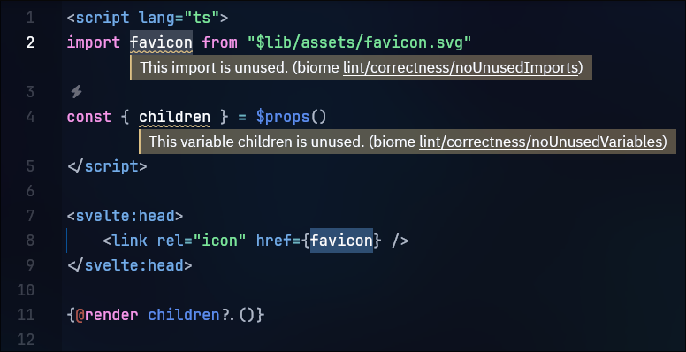
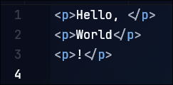
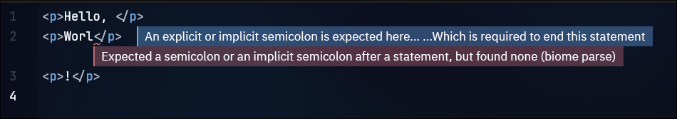
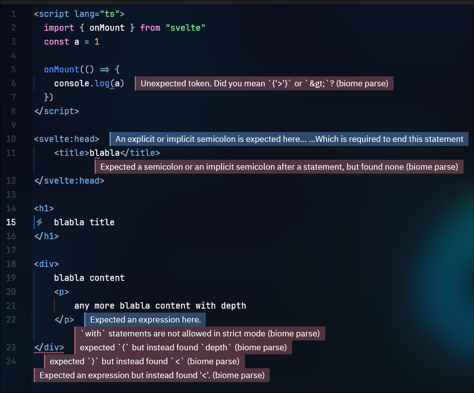

## Reproduction Steps

1. Clone it
2. Run `bunx biome check` to you can see no problem in CLI.
3. **Problem 1:** See the [`./packages/app/src/lib/routes/+layout.svelte`](./packages/app/src/lib/routes/+layout.svelte) file. Biome configuration in monorepo package is not applied the config is [here](./packages/app/biome.json).

4. **Problem 2:** See the [`./packages/app/src/lib/routes/+page.svelte`](./packages/app/src/lib/routes/+page.svelte) file. There's no problem at just open the file, but when I edit any line, Biome LSP works weird.

### Before Edit:


### After Edit:


### Write More with TypeScript:


Really weird part is it broken also TypeScript LSP.

This is my server-side biome server info:

```json
* Server: biome (id 51)

* Binary: LanguageServerBinary {
    path: "/usr/bin/node",
    arguments: [
        "/home/pleahmacaka/CodeHere/biome-report-minimal/node_modules/@biomejs/biome/bin/biome",
        "lsp-proxy",
    ],
    env: Some(
        {
            ...some env vars
        },
    ),
}

* Registered workspace folders:
/home/pleahmacaka/CodeHere/biome-report-minimal

* Capabilities: {
  "positionEncoding": "utf-16",
  "textDocumentSync": 2,
  "codeActionProvider": {
    "codeActionKinds": [
      "quickfix.biome",
      "quickfix.suppressRule.topLevel.biome",
      "quickfix.suppressRule.inline.biome",
      "source.organizeImports.biome",
      "source.fixAll.biome",
      "refactor.biome",
      "refactor.extract.biome",
      "refactor.inline.biome",
      "refactor.rewrite.biome",
      "source.biome"
    ]
  },
  "documentFormattingProvider": true,
  "documentRangeFormattingProvider": true,
  "documentOnTypeFormattingProvider": {
    "firstTriggerCharacter": "}",
    "moreTriggerCharacter": [
      "]",
      ")"
    ]
  },
  "workspace": {
    "workspaceFolders": {
      "supported": true,
      "changeNotifications": true
    }
  }
}

* Configuration: {
  "biome": {
    "configurationPath": "/home/pleahmacaka/CodeHere/biome-report-minimal/biome.json",
    "requireConfiguration": true
  }
}
```
